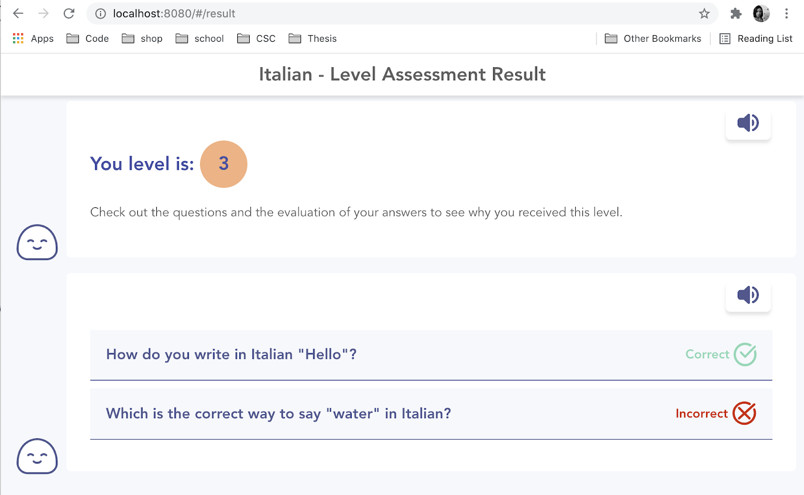

### SideEducation

#### Developers 
* Aida-Denisa Opîrlesc
* Alice Casali
* Iacopo Marri
* Ozan Incesulu

#### About

This project is implemented as a part of Digital Innovation Lab course, composed of 2 parts.
1. Front-end implementation as a prototype for the evaluation questionnaire including handwriting detection and text-to-speech integrations.
2. MongoDB database implementation for demonstrating NoSQL usage for persisting and querying entities.


##### Application
* **Implementation details**:
  
  We chose to create a front-end client application written in **JavaScript**, and using **Vue.JS** framework, as well as **Firebase SDK**. Because of the limited functionalities that we are implementing, we chose to use **Firebase Functions**, in order to calculate the level assigned to the user based on the answer to the questions. In the functions, we instantiate **Google Vision Client** and **Text To Speech Client**, in order to evaluate the image with the handwritten word, or to convert some text to an audio buffer when the user needs to hear the question out loud.
* **Architecture**:
  
  

* **Screenshots**:
  
  
  
  
* **Execution Instructions**:
  * Install NodeJS and NPM.
  * Run
  ```bash
  cd side
  npm i
  npm run serve
  ```

#### Database

* **Implementation details**:

  We have used **Python** and the **Faker** library to generate random entities to demonstrate the usage of MongoDB for our data model entities. After generating, we have used **PyMongo** to insert the documents to the database and created 8 significant queries that we believe would show the power and usage of MongoDB for our theoretical project.

* **Execution Instructions**:
  * Install Docker
  * Run
  ```bash
  cd mongo
  docker compose up
  ```
